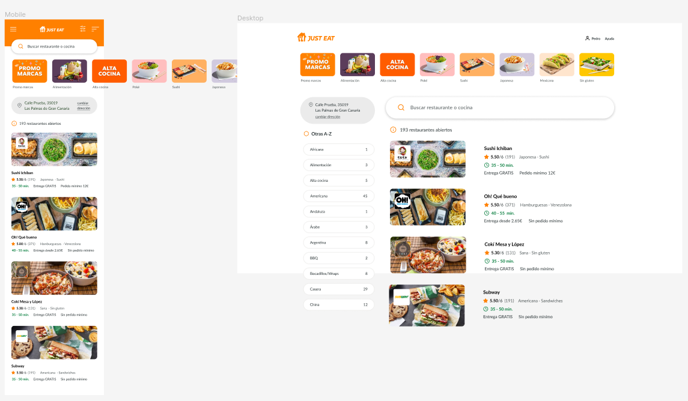

# Un encargo que da hambre

<aside>
🌟 **Objetivos de la práctica**

El objetivo de esta práctica final es el de estructurar y maquetar un documento HTML que sea fiel al diseño de la página de distribución de comida a domicilio **Just Eat,** siguiendo para ello las directrices pautadas por un diseño realizado en **Figma.**

La práctica **busca asemejarse lo máximo posible a una situación real** con la que podría encontrarse un programador Front End en su día a día.

</aside>

# Descripción

La compañía Just Eat está en busca de una ampliación de su plantilla de programadores Front End y  por ello han organizado un concurso a nivel nacional para captar al mejor talento posible. Tras enterarte de la noticia, no tardaste mucho en enviar tu solicitud de participación. Hoy, revisando tu bandeja de entrada, te llevaste una grata sorpresa al descubrir que habías sido admitido en el concurso gracias a un email del equipo de Just Eat en el que se te indicaba las instrucciones de la siguiente prueba. El mensaje decía lo siguiente:

<aside>
✉️ **Estimado aspirante,**

Nos alegra saber que desea formar parte de nuestro equipo en Just Eat. Como se ha mencionado en previos comunicados, nos encontramos actualmente en proceso de expansión y este concurso es la manera perfecta a la que hemos llegado para **encontrar a los mejores talentos del país**. Estamos seguros de que uno de esos talentos podría ser usted, por lo que estamos ansiosos por conocer su rendimiento en la siguiente prueba.

Para esta prueba, deberá de **replicar la interfaz que tiene actualmente nuestra plataforma web de Just Eat**. La fidelidad del diseño es un punto imprescindible en esta prueba, por lo que tendrá que luchar para obtener una **maquetación lo más exacta posible**. Para ayudarle en dicha tarea, nuestros diseñadores nos han proporcionado los diseños de las pantallas originales reunidos en un Figma.

**Reglas:**

- **El diseño deberá de ser *reponsive*.** En el Figma adjunto se encuentra diseñada tanto la versión de escritorio como la versión móvil.
- La mayoría de los recursos, como las fuentes y colores, deberá de **sacarlos directamente del diseño del Figma** (opción de exportar) o a través de herramientas como [Google Fonts](https://fonts.google.com/).
- Es imprescindible que la **estructura de la página sea lo más semántica posible**.
- **Errores sintácticos o una estructura no óptima del HTML supondría la invalidación de la prueba** y su consecuente descalificación del concurso.
- Es obligatorio utilizar, como mínimo, **5 pseudo-clases o pseudo-elemento**s (por ejemplo, añadir efectos al pasar el ratón por encima con `:hover`). Teoría relacionada → [9. Las pseudo-clases y los pseudo-elementos](https://www.notion.so/9-Las-pseudo-clases-y-los-pseudo-elementos-e1e2ff0f97b048039461359623aab46a)
- **Se valorará muy positivamente** la utilización de la metodología BEM a la hora de nombrar las clases. Teoría relacionada → [14. BEM](https://www.notion.so/14-BEM-437cc83d2928488186d59b912bac2ad9)

Esperamos que los requerimientos hayan quedado claros. Ante cualquier duda, no dude en ponerse en contacto con nosotros. Le deseamos la mayor de la suertes en esta prueba.

Atentamente,

El equipo de Just Eat.

</aside>

<aside>
🖌️ **Enlace Figma**

Es imprescindible crearse una cuenta para poder descargar recursos y ver las especificaciones de cada elemento.

[Ver Figma](https://www.figma.com/file/tBgkX0T6O5Cxh6aPu6qyx1/Just-Eat-Interface?node-id=0%3A1)

</aside>

